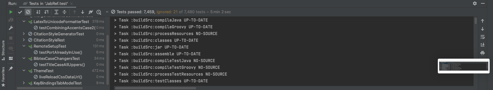

# Testes de unidade 

## 1. Teste disponibilizados pelo JabRef

 
O código do JabRef já tem teste desenvolvidos anteriormente. Que são 7480 ao todo.

 
Em uma execução no IntelliJ optive 7459 testes aprovados e 21 ignorados (skip), como pode ser visto na figura 01. Com um tempo de execução de 5 min 2 sec.

<figcaption>Figura 01 - Teste do JabRef  </figcaption> 

## Versionamento

| Versão | Data | Modificação | Autor |
|--|--|--|--|
| 1.0 | 05/10/2021 | Criação do site | Antônio Aldísio |

