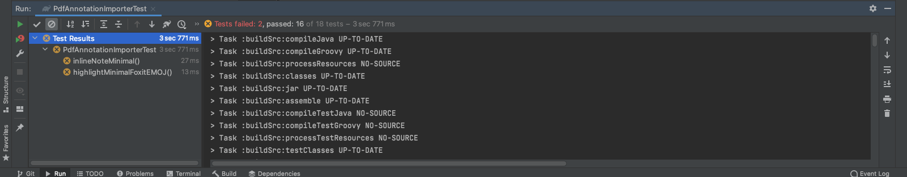
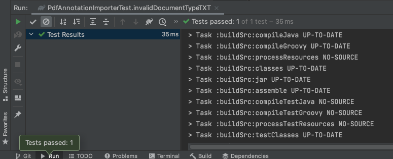
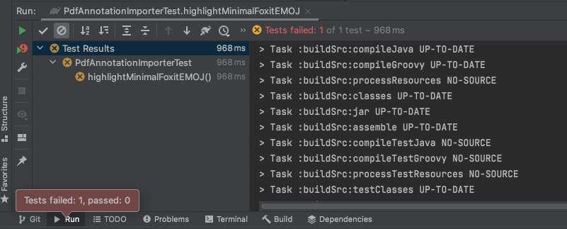

# Testes de unidade da classe PdfAnnotationImporter

## 1. Introdução

O diretorio para encontrar a classe é o seguinte:

    /src/main/java/org/jabref/logic/pdf/

Essa classe tem com objetivo de importar as  anotaçōes dentro do PDF.

## 2. Tabelas das decisões/condições

|ID | Condição| Situação para True| Situação para False|
|:--:|:--:|:--:|:--:|
| 01 | !validatePath(path)| Ter um path válido | Não ter um path válido| 
| 02 | !isSupportedAnnotationType(annotation)| não ter uma anotação válida| Ter uma anotação válida| 
| 03 | FileAnnotationType.isMarkedFileAnnotationType(annotation.getSubtype())| Existir uma anotação| Não existir uma anotação | 
| 04 | (fileAnnotation.getContent() != null) && !fileAnnotation.getContent().isEmpty()| Tem uma anotação e ela está vazia | Não tem uma anotação e ela não está vazia | 
| 05 | annotation.getSubtype() == null| Ter uma anotação vazia| Ter uma anotação prenchida| 
| 06 | "Link".equals(annotation.getSubtype()) || "Widget".equals(annotation.getSubtype())| Ter uma anotação que tenha link ou ter uma anotação Widget| Não ter uma anotação que tenha link ou não ter uma anotação Widget|
| 07 | !Arrays.asList(FileAnnotationType.values()).contains(FileAnnotationType.valueOf(annotation.getSubtype()))| Não ter a lista de anotação vazia | Ter a lista de anotação vazia |
| 08 | annotationBelongingToMarking.getAnnotationType().isLinkedFileAnnotationType()| Criar uma marca na anotação  | Não criar uma marca na anotação| 
| 09 | !path.toString().toLowerCase(Locale.ROOT).endsWith(".pdf")| Arquivo em formato PDF | Não em outro formatos| 
| 10 | !Files.exists(path)| Não existir arquivo| Existe o arquivo |
| 11 | !Files.isRegularFile(path) || !Files.isReadable(path)| Não tem formato desejado ou não conseguiu ler informaçōes dentro da anotação | Tem formato desejado ou conseguiu ler informaçōes dentro da anotação | 

## 3. Código 

### 3.1 Código de Produção 

    public class PdfAnnotationImporter implements AnnotationImporter {

        private static final Logger LOGGER = LoggerFactory.getLogger(PdfAnnotationImporter.class);

        /**
        * Imports the comments from a pdf specified by its path
        *
        * @param path a path to a pdf
        * @return a list with the all the annotations found in the file of the path
        */
        @Override
        public List<FileAnnotation> importAnnotations(final Path path) {

            if (!validatePath(path)) {
                // Path could not be validated, return default result
                return Collections.emptyList();
            }

            List<FileAnnotation> annotationsList = new LinkedList<>();
            try (PDDocument document = PDDocument.load(path.toFile())) {
                PDPageTree pdfPages = document.getDocumentCatalog().getPages();
                for (int pageIndex = 0; pageIndex < pdfPages.getCount(); pageIndex++) {
                    PDPage page = pdfPages.get(pageIndex);
                    for (PDAnnotation annotation : page.getAnnotations()) {
                        if (!isSupportedAnnotationType(annotation)) {
                            continue;
                        }

                        if (FileAnnotationType.isMarkedFileAnnotationType(annotation.getSubtype())) {
                            annotationsList.add(createMarkedAnnotations(pageIndex, page, annotation));
                        } else {
                            FileAnnotation fileAnnotation = new FileAnnotation(annotation, pageIndex + 1);
                            if ((fileAnnotation.getContent() != null) && !fileAnnotation.getContent().isEmpty()) {
                                annotationsList.add(fileAnnotation);
                            }
                        }
                    }
                }
            } catch (IOException e) {
                LOGGER.error(String.format("Failed to read file '%s'.", path), e);
            }
            return annotationsList;
        }

        private boolean isSupportedAnnotationType(PDAnnotation annotation) {
            if (annotation.getSubtype() == null) {
                return false;
            }
            if ("Link".equals(annotation.getSubtype()) || "Widget".equals(annotation.getSubtype())) {
                LOGGER.debug(annotation.getSubtype() + " is excluded from the supported file annotations");
                return false;
            }
            try {
                if (!Arrays.asList(FileAnnotationType.values()).contains(FileAnnotationType.valueOf(annotation.getSubtype()))) {
                    return false;
                }
            } catch (IllegalArgumentException e) {
                LOGGER.debug(String.format("Could not parse the FileAnnotation %s into any known FileAnnotationType. It was %s!", annotation, annotation.getSubtype()));
            }
            return true;
        }

        private FileAnnotation createMarkedAnnotations(int pageIndex, PDPage page, PDAnnotation annotation) {
            FileAnnotation annotationBelongingToMarking = new FileAnnotation(
                    annotation.getCOSObject().getString(COSName.T), FileAnnotation.extractModifiedTime(annotation.getModifiedDate()),
                    pageIndex + 1, annotation.getContents(), FileAnnotationType.valueOf(annotation.getSubtype().toUpperCase(Locale.ROOT)), Optional.empty());

            if (annotationBelongingToMarking.getAnnotationType().isLinkedFileAnnotationType()) {
                try {
                    COSArray boundingBoxes = (COSArray) annotation.getCOSObject().getDictionaryObject(COSName.getPDFName("QuadPoints"));
                    annotation.setContents(new TextExtractor(page, boundingBoxes).extractMarkedText());
                } catch (IOException e) {
                    annotation.setContents("JabRef: Could not extract any marked text!");
                }
            }

            // Marked text that has a sticky note on it should be linked to the sticky note
            return new FileAnnotation(annotation, pageIndex + 1, annotationBelongingToMarking);
        }

        private boolean validatePath(Path path) {
            Objects.requireNonNull(path);

            if (!path.toString().toLowerCase(Locale.ROOT).endsWith(".pdf")) {
                LOGGER.warn(String.format("File '%s' does not end with .pdf!", path));
                return false;
            }

            if (!Files.exists(path)) {
                LOGGER.warn(String.format("File '%s' does not exist!", path));
                return false;
            }

            if (!Files.isRegularFile(path) || !Files.isReadable(path)) {
                LOGGER.warn(String.format("File '%s' is not readable!", path));
                return false;
            }

            return true;
        }
    }

### 3.2 Código de Teste 

    package org.jabref.logic.pdf;

    import java.nio.file.Path;
    import java.time.LocalDateTime;
    import java.util.Collections;
    import java.util.Optional;

    import org.jabref.model.pdf.FileAnnotation;
    import org.jabref.model.pdf.FileAnnotationType;

    import org.junit.jupiter.api.Test;

    import static org.junit.jupiter.api.Assertions.assertEquals;

    public class PdfAnnotationImporterTest {

        private final AnnotationImporter importer = new PdfAnnotationImporter();

        @Test
        public void invalidPath() {
            assertEquals(Collections.emptyList(), importer.importAnnotations(Path.of("/asdf/does/not/exist.pdf")));
        }

        @Test
        public void invalidDirectory() {
            assertEquals(Collections.emptyList(), importer.importAnnotations(Path.of("src/test/resources/pdfs")));
        }

        @Test
        public void invalidDocumentType() {
            assertEquals(Collections.emptyList(), importer.importAnnotations(Path.of("src/test/resources/pdfs/write-protected.docx")));
        }

        @Test
        public void noAnnotationsWriteProtected() {
            assertEquals(Collections.emptyList(), importer.importAnnotations(Path.of("src/test/resources/pdfs/write-protected.pdf")));
        }

        @Test
        public void noAnnotationsEncrypted() {
            assertEquals(Collections.emptyList(), importer.importAnnotations(Path.of("src/test/resources/pdfs/encrypted.pdf")));
        }

        @Test
        public void twoAnnotationsThesisExample() {
            assertEquals(2, importer.importAnnotations(Path.of("src/test/resources/pdfs/thesis-example.pdf")).size());
        }

        @Test
        public void noAnnotationsMinimal() {
            assertEquals(Collections.emptyList(), importer.importAnnotations(Path.of("src/test/resources/pdfs/minimal.pdf")));
        }

        @Test
        public void inlineNoteMinimal() {
            final FileAnnotation expected = new FileAnnotation("Linus Dietz", LocalDateTime.of(2017, 3, 12, 20, 25), 1,
                    "inline note annotation", FileAnnotationType.FREETEXT, Optional.empty());

            assertEquals(Collections.singletonList(expected),
                    importer.importAnnotations(Path.of("src/test/resources/pdfs/minimal-inlinenote.pdf")));
        }

        @Test
        public void popupNoteMinimal() {
            final FileAnnotation expected = new FileAnnotation("Linus Dietz", LocalDateTime.of(2017, 3, 12, 20, 17, 24), 1,
                    "A simple pop-up note", FileAnnotationType.TEXT, Optional.empty());

            assertEquals(Collections.singletonList(expected),
                    importer.importAnnotations(Path.of("src/test/resources/pdfs/minimal-popup.pdf")));
        }

        @Test
        public void highlightMinimalFoxit() {
            final FileAnnotation expectedLinkedAnnotation = new FileAnnotation("lynyus", LocalDateTime.of(2017, 5, 31, 15, 16, 1), 1,
                    "this is a foxit highlight", FileAnnotationType.HIGHLIGHT, Optional.empty());
            final FileAnnotation expected = new FileAnnotation("lynyus", LocalDateTime.of(2017, 5, 31, 15, 16, 1), 1,
                    "Hello", FileAnnotationType.HIGHLIGHT, Optional.of(expectedLinkedAnnotation));
            assertEquals(Collections.singletonList(expected),
                    importer.importAnnotations(Path.of("src/test/resources/pdfs/minimal-foxithighlight.pdf")));
        }

        @Test
        public void highlightNoNoteMinimal() {
            final FileAnnotation expectedLinkedAnnotation = new FileAnnotation("Linus Dietz", LocalDateTime.of(2017, 3, 12, 20, 28, 39), 1,
                    "", FileAnnotationType.HIGHLIGHT, Optional.empty());
            final FileAnnotation expected = new FileAnnotation("Linus Dietz", LocalDateTime.of(2017, 3, 12, 20, 28, 39), 1,
                    "World", FileAnnotationType.HIGHLIGHT, Optional.of(expectedLinkedAnnotation));

            assertEquals(Collections.singletonList(expected),
                    importer.importAnnotations(Path.of("src/test/resources/pdfs/minimal-highlight-no-note.pdf")));
        }

        @Test
        public void squigglyWithNoteMinimal() {
            final FileAnnotation expectedLinkedAnnotation = new FileAnnotation("lynyus", LocalDateTime.of(2017, 6, 1, 2, 40, 25), 1,
                    "Squiggly note", FileAnnotationType.SQUIGGLY, Optional.empty());
            final FileAnnotation expected = new FileAnnotation("lynyus", LocalDateTime.of(2017, 6, 1, 2, 40, 25), 1,
                    "ello", FileAnnotationType.SQUIGGLY, Optional.of(expectedLinkedAnnotation));

            assertEquals(Collections.singletonList(expected),
                    importer.importAnnotations(Path.of("src/test/resources/pdfs/minimal-squiggly.pdf")));
        }

        @Test
        public void strikeoutWithNoteMinimal() {
            final FileAnnotation expectedLinkedAnnotation = new FileAnnotation("lynyus", LocalDateTime.of(2017, 6, 1, 13, 2, 3), 1,
                    "striked out", FileAnnotationType.STRIKEOUT, Optional.empty());
            final FileAnnotation expected = new FileAnnotation("lynyus", LocalDateTime.of(2017, 6, 1, 13, 2, 3), 1,
                    "World", FileAnnotationType.STRIKEOUT, Optional.of(expectedLinkedAnnotation));

            assertEquals(Collections.singletonList(expected),
                    importer.importAnnotations(Path.of("src/test/resources/pdfs/minimal-strikeout.pdf")));
        }

        @Test
        public void highlightWithNoteMinimal() {
            final FileAnnotation expectedLinkedAnnotation = new FileAnnotation("Linus Dietz", LocalDateTime.of(2017, 3, 12, 20, 32, 2), 1,
                    "linked note to highlight", FileAnnotationType.HIGHLIGHT, Optional.empty());
            final FileAnnotation expected = new FileAnnotation("Linus Dietz", LocalDateTime.of(2017, 3, 12, 20, 32, 2), 1,
                    "World", FileAnnotationType.HIGHLIGHT, Optional.of(expectedLinkedAnnotation));

            assertEquals(Collections.singletonList(expected),
                    importer.importAnnotations(Path.of("src/test/resources/pdfs/minimal-highlight-with-note.pdf")));
        }

        @Test
        public void underlineWithNoteMinimal() {
            final FileAnnotation expectedLinkedAnnotation = new FileAnnotation("Linus Dietz", LocalDateTime.of(2017, 3, 12, 20, 36, 9), 1,
                    "underlined", FileAnnotationType.UNDERLINE, Optional.empty());
            final FileAnnotation expected = new FileAnnotation("Linus Dietz", LocalDateTime.of(2017, 3, 12, 20, 36, 9), 1,
                    "Hello", FileAnnotationType.UNDERLINE, Optional.of(expectedLinkedAnnotation));

            assertEquals(Collections.singletonList(expected),
                    importer.importAnnotations(Path.of("src/test/resources/pdfs/minimal-underline.pdf")));
        }

        @Test
        public void polygonNoNoteMinimal() {
            final FileAnnotation expected = new FileAnnotation("Linus Dietz", LocalDateTime.of(2017, 3, 16, 9, 21, 1), 1,
                    "polygon annotation", FileAnnotationType.POLYGON, Optional.empty());

            assertEquals(Collections.singletonList(expected),
                    importer.importAnnotations(Path.of("src/test/resources/pdfs/minimal-polygon.pdf")));
        }

        // Teste proposto por Antônio Aldisio
        // Verificar se abre arquivo TXT
        @Test
        public void invalidDocumentTypeTXT() {
            assertEquals(Collections.emptyList(), importer.importAnnotations(Path.of("src/test/resources/pdfs/teste.txt")));
        }
        // Verificar se ele consegue ler alguma Emoji
        @Test
        public void highlightMinimalFoxitEMOJ() {
            final FileAnnotation expectedLinkedAnnotation = new FileAnnotation("lynyus", LocalDateTime.of(2017, 5, 31, 15, 16, 1), 1,
                    "😂, 😃, 🧘🏻‍♂️, 🌍, 🍞, 🚗, 📞, 🎉, ❤️, 🍆", FileAnnotationType.HIGHLIGHT, Optional.empty());
            final FileAnnotation expected = new FileAnnotation("lynyus", LocalDateTime.of(2017, 5, 31, 15, 16, 1), 1,
                    "Hello", FileAnnotationType.HIGHLIGHT, Optional.of(expectedLinkedAnnotation));
            assertEquals(Collections.singletonList(expected),
                    importer.importAnnotations(Path.of("src/test/resources/pdfs/minimal-emoji.pdf")));
        }
    }

## 4. Resultados

### 4.1 Resultados dos Testes JabRef

Na figura 01 temos o resultado dos testes da classe PdfAnnotationImporter. Podemos observar que dois testes não passaram. O primeiro teste que não passou foi produzido pela JabRef e ele errou, pois alterei o comentário esperado. Então esse teste já era esperado em não passar. Já o segundo teste foi projetado por mim e será descuitdo logo adiante.

<figcaption>Figura 01 - Resultado dos teste da classe PdfAnnotationImporter </figcaption> 

### 4.2 Resultados dos meus Testes

Para essa etapa do projeto preferi executar apenas dois testes novos. Em relação aos ID 01 e 11. 

#### 4.2.1 Resultado do teste ID 01

O teste do ID 01 já existia uma corbertura, porém a corbertura só verificava se não abria outros formatos. Com isso, fique curioso para ver se ele não executava outro tipo de formato então teste o formato .TXT. A partir da figura 02 podemos ver que o JabRef não consegue abrir um texto em formato .TXT o que era já esperado.

<figcaption>Figura 02 - Resultado do Teste do ID 01</figcaption> 

#### 4.2.2 Resultado do teste ID 11

O teste do ID 11 já não existia uma corbertura. Altere um  <a href = "https://github.com/AntoonioAldisio/jabref/blob/main/src/test/resources/pdfs/minimal-emoji.pdf"> PDF  </a> com um comentário para uma série de Emoji (😂, 😃, 🧘🏻‍♂️, 🌍, 🍞, 🚗, 📞, 🎉, ❤️, 🍆). A partir da figura 03 podemos ver que o teste não passou. 

Não entendi o motivo do teste não ter passado, pelo o motivo da condição ser um OU, sendo necessário apenas uma afirmação ser verdadeira. O arquivo consegue ser aberto então, ou seja, já tenho uma condiça6o verdadeira, o teste deveria ser passado já que Emoji não é uma linguagem não comprendida pelo JabRef.

<figcaption>Figura 03 - Resultado do Teste do ID 11</figcaption> 

## Versionamento

| Versão | Data | Modificação | Autor |
|--|--|--|--|
| 1.0 | 05/10/2021 | Criação do site | Antônio Aldísio |
| 2.0 | 07/10/2021 | Colocar os teste | Antônio Aldísio |

